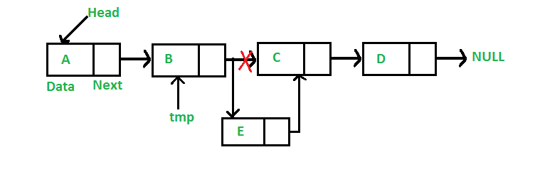

# Linked List – Introduction – Singly list implementation

## What is a Linked List?

A **Linked List** is a **dynamic data structure** used to store elements. Unlike arrays, elements in a linked list are **not stored in contiguous memory locations**, can't use index to jump directy to an element

- Each element in a linked list is called a **Node**
- Each **Node** contains:
  1. **Data** → the actual value of the element
  2. **Next** → a pointer to the next Node in the list

## Types of linked list

1. **Singly Linked List**  
   - Each node has a pointer to the **next node only**  
   - Traversal is **forward only**

2. **Doubly Linked List**  
   - Each node has pointers to **next** and **previous nodes**
   - Traversal can be **forward and backward**

3. **Circular Linked List**  
   - The last node points back to the **head node**  
   - Can be singly or doubly linked

## Singly Linked List
    - Each node has a pointer to the next node only
    - Traversal is forward only

----
## Core Operations (Singly Linked List)

### 1. Insert at Last
**Name:** `insert_last`  

**Inputs:**  
- New data  

**Process:**  
1. Create a new node for the data  
2. If the list is empty → set both **head** and **tail** to the new node  
3. Else →  
   - Link current **tail.next** to the new node  
   - Update **tail** to the new node  

**Output:** Nothing  

---

### 2. Insert After

**Name:** `insert_after`  

**Inputs:**  
- Node  
- New data  

**Process:**  
1. Validate node is not null  
2. Create a new node for the data  
3. Set **new_node.next = node.next**  
4. Set **node.next = new_node**  
5. If `new_node.next == null` → update **tail = new_node**  

**Output:** Nothing  

---

### 3. Insert Before
**Name:** `insert_before`  

**Inputs:**  
- Node  
- New data  

**Process:**  
1. Validate node is not null  
2. Create a new node for the data  
3. If `node == head`:  
   - Set **new_node.next = head**  
   - Update **head = new_node**  
4. Else:  
   - Find the **parent node** (the one pointing to `node`)  
   - Set **parent.next = new_node**  
   - Set **new_node.next = node**  

**Output:** Nothing  

---

### 4. Delete Node

**Name:** `delete_node`  

**Inputs:**  
- Node  

**Process:**  
1. Validate node is not null  
2. If node is both **head and tail**:  
   - Set **head = tail = null**  
3. Else if node is **head**:  
   - Set **head = head.next**  
4. Else:  
   - Find the **parent node**  
   - If node is **tail** → update **tail = parent**  
   - Else → set **parent.next = node.next**  
5. Free/delete the node  

**Output:** Nothing  