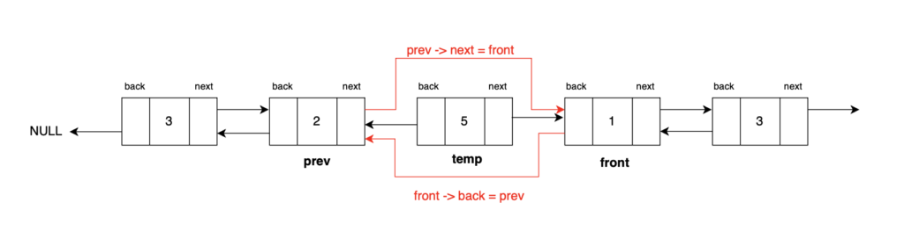

# Linked List – Doubly list implementation

## Doubly Linked List

- Each node has pointers to **next** and **previous nodes**
- Traversal can be **forward and backward**

----

## Core Operations (Doubly Linked List)

### 1. Insert at Last

**Name:** `insert_last`  

### Inputs  

- `data` → The value to be stored in the new node.  

**Process:**  

1. Create a new node for the data  
2. If the list is empty → set both **head** and **tail** to the new node  
3. **Else** →  
   - Set the current **tail.next** to the new node.  
   - Set the new node’s **back** pointer to the current tail.  
   - Update the **tail** pointer to the new node.
4. Increase the **length** of the list by 1.  

**Output:** Nothing  

---

### 2. Insert After

**Name:** `insert_after`  

### Inputs  

- `prev_data` → The data of the node after which the new node should be inserted.  
- `data` → The value to be stored in the new node.  

**Process:**  

1. Validate node is not null
2. **Create a new node** with the given `data`.  
3. Set the **new_node.next** pointer to the next of the previous node.  
4. Set the **new_node.back** pointer to the previous node.  
5. Update the **previous node.next** to point to the `new_node`.  
6. **If the new_node is the last node** → update the **tail** pointer.  
7. **Else** → update the next node’s **back** pointer to point to the `new_node`.
8. Increase the **length** of the list by 1.  

**Output:** Nothing  

---

### 3. Insert Before

**Name:** `insert_before`  

### Inputs  

- `next_data` → The data of the node before which the new node should be inserted.  
- `new_data` → The value to be stored in the new node.  

### Process  

1. **Validate** → Find the next node using `next_data`. If not found, return.  
2. **Create a new node** with the given `new_data`.  
3. Set **new_node.next** to the `next_node`.  
4. If the `next_node.back` is `None` (i.e., `next_node` is the head):  
   - Set the new node as the **head**.  
   - Set `new_node.back` = `None`.  
   - Update `next_node.back` to point to the new node.  
5. Else:  
   - Link `new_node.back` to `next_node.back`.  
   - Update the **previous node.next** to point to `new_node`.  
   - Update `next_node.back` to point to `new_node`.
6. Increase the **length** of the list by 1.  

**Output:** Nothing  

---

### 4. Delete Node

**Name:** `delete_node`  

**Inputs:**  

- `data_to_delete`: The data of the node you want to remove.  

**Process:**  

1. Get the node to delete using `get_node(data_to_delete)`  
2. If the node is **head only** → update `head` to next node and set `back = None`  
3. If the node is **tail only** → update `tail` to previous node and set `next = None`  
4. If the node is **both head and tail** (only one node) → set `head = None` and `tail = None`  
5. Else (node in the **middle**):  
   - Update `node.back.next = node.next`  
   - Update `node.next.back = node.back`  
6. Decrease list length by 1  

**Output:**  

- Node is removed from the list  

---

### 5. Copy Linked list

**Name:** `copy`  

**Inputs:**  

- None  

**Process:**  

1. Create a new empty `DoublyLinkedList`  
2. Start from the `head` of the current list  
3. Traverse each node:  
   - Insert the current node’s data into the new list using `insert_last`  
   - Move to the next node  
4. Continue until reaching the end of the list  
5. Return the new copied list  

**Output:**  

- A **new independent copy** of the current doubly linked list  
