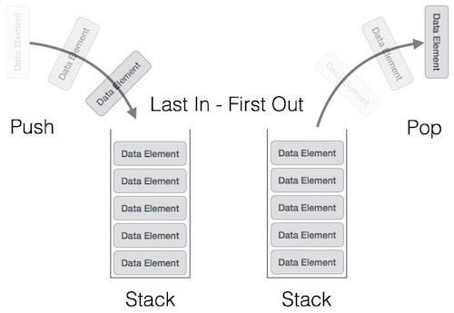
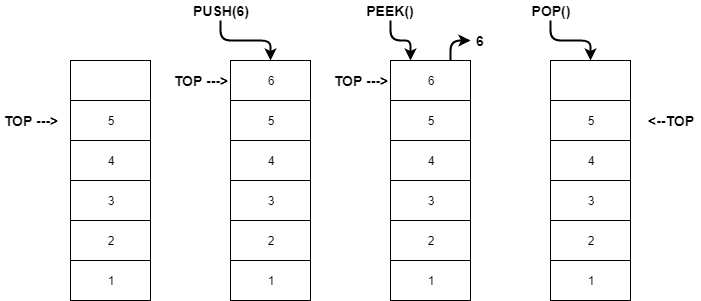

# Stack Introduction

## What is stack?

A stack is a linear data structure that follows the principle of `LIFO` (Last In, First Out).  
This means that the last element added (`pushed`) to the stack will be the first one removed (`popped`).

---

## Characteristics of Stack

- **Linear structure**: Elements are ordered sequentially.  
- **Restricted access**: Only the **top** element can be accessed directly.  
- **Dynamic size**: Can grow or shrink with push/pop operations.  
- **LIFO principle**: Last in, first out.  

---

## Stack Implementation

1. **Linked List-based stack**  
   - Uses a linked list where each node contains data and a pointer to the next node.  
   - The top of the stack is represented by the head of the linked list.  
   - **Advantages:** Dynamic size, no overflow (unless memory is full).  

2. **Array-based stack**  
   - Uses a fixed-size array to store elements.  
   - Operations like push and pop are done using the array index.  
   - **Limitation:** The stack has a fixed maximum size (overflow if exceeded).  

---

## Core Operations

| Operation | Description |
|-----------|-------------|
| **push(x)** | Insert element `x` at the top of the stack. |
| **pop()** | Remove and return the top element of the stack. |
| **peek() / top()** | Return the top element without removing it. |
| **isEmpty()** | Check if the stack is empty. |
| **isFull()** | Check if the stack is full (in case of fixed-size implementation). |
| **size()** | Return the current number of elements in the stack. |

---

## Stack Overflow & Underflow

- **Stack Overflow**: Occurs when trying to push an element onto a full stack (in array-based implementation).  
- **Stack Underflow**: Occurs when trying to pop an element from an empty stack.  
