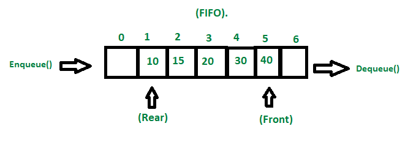
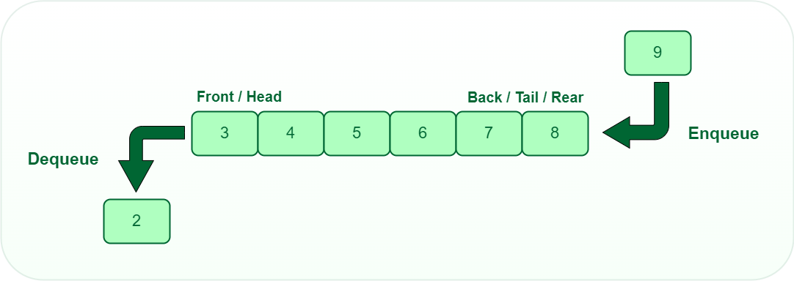
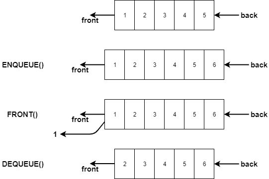
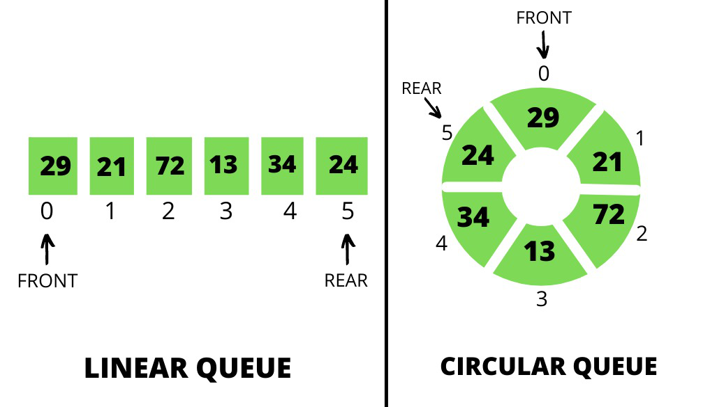
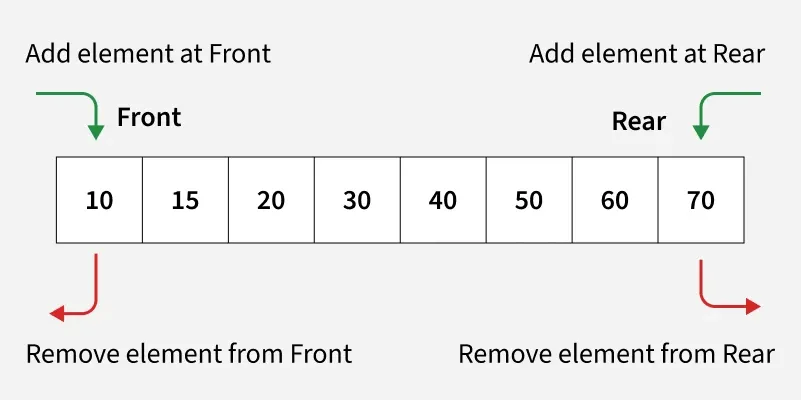

# Queue Introduction

## What is a Queue?

A **queue** is a linear data structure that follows the **FIFO** principle (First In, First Out).  
The first element added (`enqueued`) is the first one removed (`dequeued`).  

---

## Characteristics of Queue

- **Linear structure**: Elements are arranged sequentially.  
- **Restricted access**: Insertions happen at the **rear**, deletions happen at the **front**.  
- **Dynamic size**: Can grow or shrink depending on implementation.  
- **FIFO principle**: First in, first out.  

---

## Queue Implementation

1. **Array-based queue**  
   - Uses a fixed-size array or Python list.  
   - Insertion/deletion done using indices.  
   - Limitation: Fixed size or need resizing.  

2. **Linked List-based queue**  
   - Uses a linked list where each node contains data and a pointer to the next node.  
   - Front and rear pointers track the first and last elements.  
   - Advantages: Dynamic size, flexible insertions/deletions.  

---

## Core Operations

| Operation       | Description |
|-----------------|-------------|
| **enqueue(x)**  | Insert element `x` at the rear of the queue. |
| **dequeue()**   | Remove and return the front element of the queue. |
| **peek() / front()** | Return the front element without removing it. |
| **isEmpty()**   | Check if the queue is empty. |
| **isFull()**    | Check if the queue is full (for arrays). |
| **size()**      | Return the current number of elements in the queue. |

---

## Queue Overflow & Underflow

- **Queue Overflow**: Occurs when trying to enqueue into a full queue (in fixed-size array implementation).  
- **Queue Underflow**: Occurs when trying to dequeue from an empty queue.  

---

## Types of Queues

1. **Simple Queue** – standard FIFO behavior.  
2. **Circular Queue** – front and rear wrap around when reaching the end of the array.  
3. **Priority Queue** – elements removed based on priority, not insertion order.  
4. **Double-Ended Queue (Deque)** – insertion and deletion allowed at both ends.

### Simple & Circular Queue

### Double-Ended Queue (Deque)
