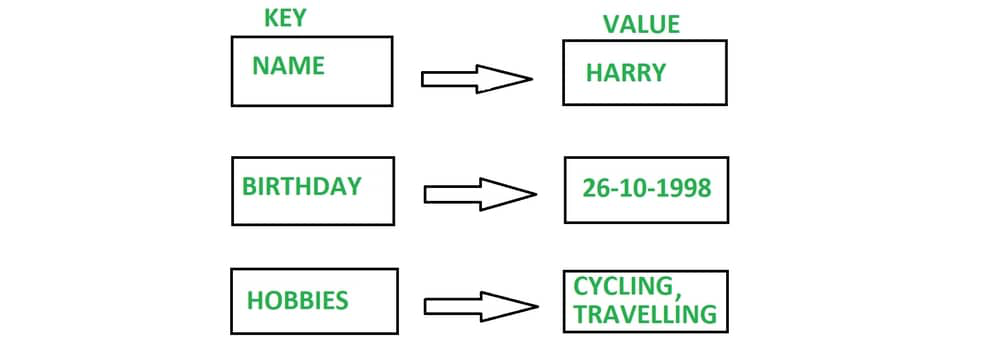

# Key–Value Pair Dictionary Implementation

## What is a Key–Value Pair?

- A **Key–Value Pair** stores data as:  
  - **Key** → unique identifier.  
  - **Value** → the data linked to that key.  

Example:  

- `("NAME", "HARRY")`  

---

## What is a Dictionary (Map)?

- A **Dictionary** (also called **Map, HashMap, Associative Array**) is a collection of **Key–Value Pairs**.  
- Each **Key is unique**, while values may repeat.  
- Usually implemented with a **Hash Table** for fast access.  

---

## Core Operations

| Operation       | Description                                                                 | Avg. Time Complexity | Worst Case |
|-----------------|-----------------------------------------------------------------------------|----------------------|------------|
| **Insert (set)**| Add a new key–value pair. If key exists → update the value.                 | `O(1)`               | `O(n)`    |
| **Search (get)**| Find the value associated with a key.                                       | `O(1)`               | `O(n)`    |
| **Update**      | Modify the value for an existing key.                                       | `O(1)`               | `O(n)`    |
| **Delete**      | Remove a key–value pair from the dictionary.                                | `O(1)`               | `O(n)`    |

---

## Why O(1) on Average?

- Dictionary uses **hashing**:  
  - Key → passed through a **hash function** → produces an **index** in an internal array.  
  - This allows **insert, search, delete** in constant time (`O(1)`).  

---

## Why Worst Case O(n)?

- If many keys **collide** (map to the same index), they are stored in a linked list or bucket.  
- Searching requires scanning that list → up to `O(n)`.  
- Modern hash functions minimize collisions, keeping operations fast.  

---

## Core Operations (Dictionary)

### 1. Constructor

- **Name:** `KeyValuePair`
- **Assumptions:** None
- **Inputs:** None
- **Process:**  
  - Initialize entries array with initial size.  
  - Set entries_count = 0.  
- **Output:** None  

---

### 2. Resize or not

- **Name:** `resize_or_not`
- **Assumptions:** None
- **Inputs:** None
- **Process:**  
  - If `entries_count < entries.length - 1`:  
    - Do nothing and exit.  
  - Else:  
    - New size = current length + initial_size.  
    - Create new array with new size.  
    - Copy old entries into new array.  
    - Delete old array.  
    - Point entries variable to new array.  
- **Output:** None  

---

### 3. Set

- **Name:** `set`
- **Assumptions:** None
- **Inputs:** `key`, `value`
- **Process:**  
  - Search for `key` in entries.  
    - If key exists → update value.  
    - Else:  
      - Call `resize_or_not`.  
      - Create new `KeyValuePair(key, value)` and add to entries.  
      - Increase entries_count by 1.  
- **Output:** None  

---

### 4. Get

- **Name:** `get`
- **Assumptions:** None
- **Inputs:** `key`
- **Process:**  
  - Search for `key` in entries.  
    - If found → return value.  
    - Else → return null/default.  
- **Output:** `value` or `null`

---

### 5. Delete

- **Name:** `delete`
- **Assumptions:** None
- **Inputs:** `key`
- **Process:**  
  - Search for `key` in entries.  
    - If found:  
      - Replace it with the last entry.  
      - Remove last entry (or set it to null).  
      - Decrease entries_count by 1.  
    - Else: return false.  
- **Output:** `true` if deleted, `false` if not found  
