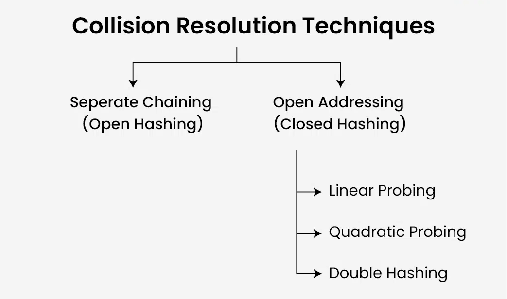
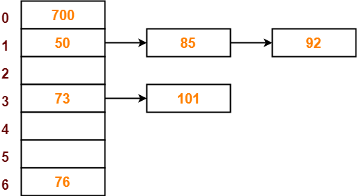

# Hash Table – Introduction

## What is a Hash Table?

A **Hash Table** (also called a **Hash Map**) is a **data structure** that stores **key–value pairs** and allows **fast insertion, deletion, and lookup** of values based on keys.  

- It uses a **hash function** to convert a key into an **index** in an array.  
- This index determines where the value is stored.

---

# Core Operations of Hash Table

### In other words, what makes a Hash Table a Hash Table

1. **Converting Key to Array Index**
   - Hash function converts the key into an **index**.
   - This index determines where the value is stored in the array.

2. **Collision Handling**
   - **Collision:** When **two keys** produce the **same index** after hashing.
   - **Why it happens:** Limited array size vs. potentially unlimited keys.

---

## Collision Resolution Techniques



| Term | Meaning |
|------|---------|
| **Open Addressing:** |  open for any index in hash table |
| **Close Hashing:** | Closed but leave the current hash table |
| **Seperate Chaining or Close Addressing:**|  closed, don't change the index |
| **Open Hashing:** |  open for use any other data structure in conjunction with the current hash table |

---

| Technique | Type | Description |
|------------|------|-------------|
| Linear Probing | Open Addressing | Check next slots sequentially |
| Quadratic Probing | Open Addressing | Use i² jumps to reduce clustering |
| Double Hashing | Open Addressing | Use a second hash function for step size |
| Separate Chaining | Closed Hashing | Use a list at each index to hold multiple items |

---

### 1- Linear Probing (Open Addressing)

**Definition:**  
When a collision occurs, **linear probing** searches for the next available slot **sequentially** in the hash table array.

**Process:**

1. Compute the initial index: `index = hash(key) % table_size`
2. If the slot is occupied, try the next slot: `new_index = (index + 1) % table_size`
3. Repeat until an empty slot is found.
4. Wrap around the table using modulo `% n` if reaching the end.

**Main Idea:**

  ```python
    for i in range(1, n): # n-1
      new_index = (hash + i) % n
  ```

---

## 2- Quadratic Probing (Open Addressing)

**Definition:**  
When a collision occurs, **quadratic probing** searches for the next available slot by **jumping quadratically** (squares of i) instead of linearly.  
This helps reduce clustering compared to linear probing.

**Process:**

1. Compute the initial index:  

   ```python
   index = hash(key) % table_size
   ```

2. If the slot is occupied, try the next index using:`new_index = (index + pow(i, 2)) % table_size`
3. Repeat with increasing i until an empty slot is found.
4. Wrap around the table using modulo % n.
5. pow(i, 2) creates quadratic jumps (1, 4, 9, 16…).

**Main Idea:**

```python
  for i in range(1, n): # n-1
    new_index = (hash + pow(i, 2)) % n
```

## 3- Double Hashing (Open Addressing)

**Definition:**  
Double Hashing uses **a second hash function** to determine the step size when a collision occurs.  
This helps **spread keys more uniformly** and reduces clustering compared to linear or quadratic probing.

**Process:**

1. Compute the initial index:  

  ```python
  index = hash1(key) % table_size
  ```

2. If the slot is occupied, compute the next index using a second hash function: `step = hash2(key) % table_size` `new_index = (index + i * step) % table_size`
3. Repeat with increasing i until an empty slot is found.
4. Wrap around the table using modulo % n.

**Main Idea:**

```python
for i in range(1, n): # n-1
  hash2 = (hash + i) % n
  new_index = (hash + hash2) % n
```

---

## 4- Separate Chaining (Closed Hashing)

**Definition:**  
Separate Chaining is a **collision resolution technique** for hash tables where **each slot (bucket) contains a list or another data structure** to store multiple entries that hash to the same index.

**Idea:**  

- Instead of trying to find another empty slot (like in Open Addressing),  
  all colliding keys are stored **together in a linked list, array, or any collection** at the same index.



### How It Works

1. Compute the index using a hash function:  

   ```python
   index = hash(key) % table_size
   ```

1. If the slot is empty → insert the key-value pair.
2. If the slot already has entries → append the new key-value pair to the list at that slot.
3. Lookup and deletion scan the list at that slot.
