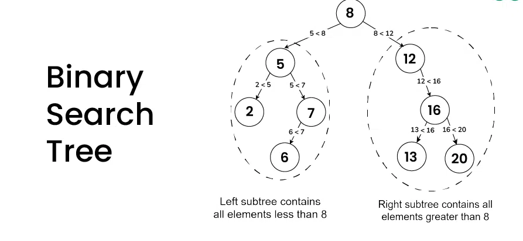

# Binary Search Tree

A **Binary Search Tree (BST)** is a special type of **binary tree** in which the **nodes are arranged in a specific order** that allows **fast searching, insertion, and deletion**.

---

## BST Property

For every node in the tree:

- All nodes in the **left subtree** have values **less than** the node’s key.
- All nodes in the **right subtree** have values **greater than** the node’s key.
- Both left and right subtrees are also **binary search trees**.

---

### Example

- Left subtree of 8 contains nodes `< 8`
- Right subtree of 8 contains nodes `> 8`



---

### Time Complexity

| Operation | Best / Average | Worst Case (Skewed Tree) |
|------------|----------------|---------------------------|
| Search     | O(log n)       | O(n)                     |
| Insert     | O(log n)       | O(n)                     |
| Delete     | O(log n)       | O(n)                     |

---

## Handling Duplicates

### 1. **Disallow Duplicates (Strict BST)**

- The simplest and most common approach.
- If a value already exists, **ignore** the insertion or **update** the existing node’s value.

### 2. Count Duplicates

- Store a **frequency counter** in each node.  
- Instead of adding a new node, simply **increment the count** when the same key is inserted again.

### 3. Insert Duplicates to a Specific Side

Allow duplicates but always insert to **one specific side**:

- **Right subtree (common):** allows equality on the right.  
- **Left subtree (less common):** allows equality on the left.

---

## Core Operations

- `insert(x)` → add a new node while maintaining BST property  
- `search(x)` → find a node by comparing recursively (O(log n) average)  
- `delete(x)` → remove a node and reattach children correctly  
- `traverse(order)` → visit nodes in specific order (inorder, preorder, postorder)

### 1. Iterative Insertion

1. If `root` is `null`:  
   - `node = new_node(data)`  
   - Return `node`

2. Set `current_node = root`

1. While `current_node` is not `null`:  
   - If `data < current_node.data`:  
     - If `current_node.left` is `null`:  
       - `current_node.left = new_node(data)`  
       - Break  
     - Else:  
       - `current_node = current_node.left`  
   - Else:  
     - If `current_node.right` is `null`:  
       - `current_node.right = new_node(data)`  
       - Break  
     - Else:  
       - `current_node = current_node.right`


---

### 2. Find

1. Set `current_node = root`

2. While `current_node` is not `null`:  
   - If `data == current_node.data`:  
     - Return `current_node`  
   - Else if `data < current_node.data`:  
     - `current_node = current_node.left`  
   - Else if `data > current_node.data`:  
     - `current_node = current_node.right`

2. Return `null`  # if not found

---

### 3. Delete

#### 1. Node is a Leaf

- Find the node to delete (`node_to_del`) and its parent.  
- If `node_to_del.left` is `null` **and** `node_to_del.right` is `null`:  
  - If `node_to_del` is the left child of its parent:  
    - `parent.left = null`  
  - Else:  
    - `parent.right = null`  

---

#### 2. Node Has One Child

- Find the node to delete (`node_to_del`) and its parent.  
- If **only one** of `node_to_del.left` or `node_to_del.right` is not `null` (XOR condition):  
  - Replace `node_to_del` with its child.  
  - `node_to_replace = node_to_del.left` **or** `node_to_del.right`  
  - `node_to_del.data = node_to_replace.data`  
  - `node_to_del.left = node_to_replace.left`  
  - `node_to_del.right = node_to_replace.right`  
  - `node_to_replace = null`  
  - Return  

---

#### 3. Node Has Two Children

- Find the node to delete (`node_to_del`) and its parent.  
- If both `node_to_del.left` and `node_to_del.right` are not `null`:  
  - Find the **smallest node in the right subtree** (inorder successor).  
    - `current_node = node_to_del.right`  
    - `parent = null`  
    - While `current_node.left` is not `null`:  
      - `parent = current_node`  
      - `current_node = current_node.left`  
  - Replace `node_to_del.data` with `current_node.data`.  
  - If `parent` is `null`:  
    - `node_to_del.right = current_node.right`  
  - Else:  
    - `parent.left = current_node.right`  
  - Delete the smallest node (inorder successor).  

---

### 4. Balance

An **in-order traversal** lists all nodes in **sorted order**.  
We can use this to store all node values in an array, then rebuild a **balanced tree**.

- Calculate the middle index and create a new node using the data from that index.  
- Divide the array into two parts — one before the middle, one after.  
- `node.left` will be the result of a recursive call on the left subarray.  
- `node.right` will be the result of a recursive call on the right subarray.

#### Balance()

- `nodes = []`  
- `inorder_to_array(root, nodes)`  
- `root = recursive_balance(0, nodes.length - 1, nodes)`

---

#### inorder_to_array(node, nodes)

```text
if node == null:
    return
inorder_to_array(node.left, nodes)
nodes.add(node.data)
inorder_to_array(node.right, nodes)
```

#### recursive_balance(start , end , nodes)

```text
if start > end:
    return null

mid = (start + end) // 2

new_node = new Node()
new_node.data = nodes[mid]

new_node.left = recursive_balance(start, mid - 1, nodes)
new_node.right = recursive_balance(mid + 1, end, nodes)

return new_node
```

`inorder_to_array()` creates a sorted list of node values

`recursive_balance()` builds the tree back from the middle outwards
