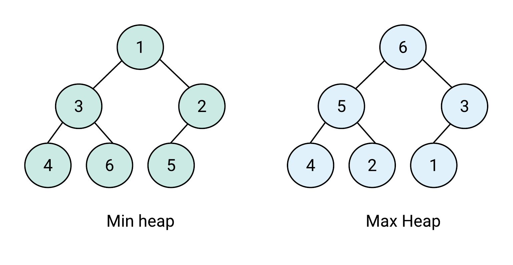
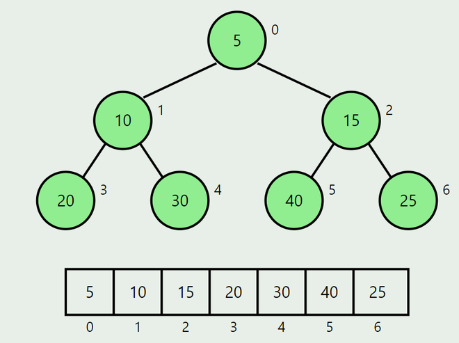

# 18_Heap_Tree

A **Heap Tree** is a special type of **complete binary tree** that satisfies the **heap property**.  
It is mainly used to implement **priority queues** and algorithms like **Heap Sort**.

---

## Heap Property

There are two main types of heaps:

### Max Heap

- Each **parent node’s value** is **greater than or equal** to its children.  
- The **largest element** is always at the **root**.

### Min Heap

- Each **parent node’s value** is **less than or equal** to its children.  
- The **smallest element** is always at the **root**.

### Example

---

## Characteristics

- A **complete binary tree** — all levels are filled except possibly the last,  
  which is filled **from left to right**.
- Provides **fast access** to the highest or lowest priority element (root).
- Usually implemented using an **array**.

---

## Array Representation

If an element is at index `i` :

| Relationship | Formula (0-based index) | Description |
|---------------|-------------------------|--------------|
| **Parent** | `(i - 1) // 2` | Gives the index of the parent node |
| **Left Child** | `(2 * i) + 1` | Gives the index of the left child |
| **Right Child** | `(2 * i) + 2` | Gives the index of the right child |

---

## Core Operations

| Operation | Description | Time Complexity |
|------------|--------------|----------------|
| `insert(x)` | Add a new element and restore heap property | **O(log n)** |
| `extract_max()` / `extract_min()` | Remove and return the root element | **O(log n)** |
| `peek()` | Return the root (max/min) without removing | **O(1)** |
| `heapify()` | Convert an array into a heap | **O(n)** |
| `delete(x)` | Remove a specific element | **O(log n)** |

---

## Operations

### 1) Insert (Min Heap)

#### **Algorithm**

1. Create a node with the **new value** in the next available location  
   (based on **level order** or **breadth-first** insertion)
2. Find the **parent** of the new node.
3. Compare the **new value** with the **parent value**:
   1. If the **new value is smaller** than the parent:
      - **Swap** parent and new node values.  
      - **Repeat** from step 2.
   2. Else:
      - **Exit** (heap property satisfied).

---

### 2) Delete (Min Heap)

#### **Algorithm:**

1. If the heap is **empty**, return.  
2. **Store the root value** (minimum element).  
3. **Move the last node** in the heap to the **root position**.  
4. **Remove** the last element and **decrease** the heap size.  
5. **Initialize** index `i = 0`.  
6. **Repeat**:
   - Calculate:
     - `left = (2 * i) + 1`  
     - `right = (2 * i) + 2`
   - Set `smallest = i`
   - If `left < size` **and** `array[left] < array[smallest]`, set `smallest = left`
   - If `right < size` **and** `array[right] < array[left]`, set `smallest = right`
   - If `array[smallest] >= array[i]`, **stop**
   - Else:
     - **Swap** `array[i]` and `array[smallest]`
     - Set `i = smallest`
     - Calculate `left = (2 * i) + 1`
7. **Return** the `root value deleted`
